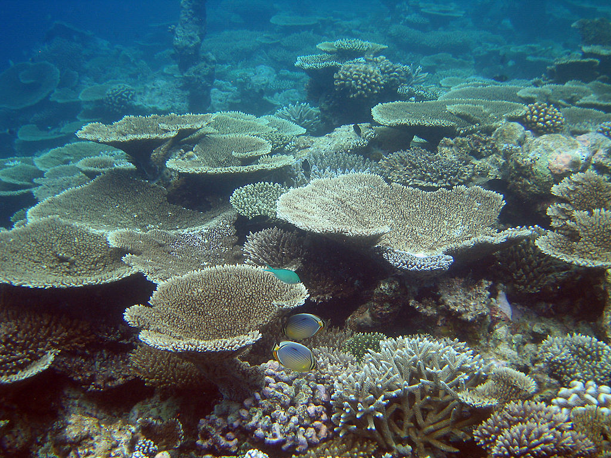

```{r setup, include=FALSE}
knitr::opts_chunk$set(echo = FALSE)
```



### source url 

https://www.sciencedaily.com/releases/2020/08/200831112354.htm
word count : 936

### vocabulary 
|Word from the text|Synonym/definition in English|French translation|
| --- | --- | --- |
|stony|the appearance of stone|pierreux |
|to flourish|to develop well|bien pousser|
|bodied|it's like body|de taille/ à corps|
|to shift|syn: to move|déplacer|
|aragonite|It’s a mineral composition from calcium carbonate|aragonite|
|thus|syn: therefore|par conséquent /ainsi|
|to fare|syn: to avoid|s'en sortir|
|to threaten|syn: to aggress|menacer|
|to prosper|to grow well|prospérer|
|hospitable|to be welcoming|hospitalier|
|shoreline|water's edge|littoral|
|to curb|edge of the sidewalk|bord du trottoir|
|to thrive|syn : to be healthy|se développer|
|anthozoan|it's a class in the classification|anthozoaire|
|to curator|syn: to keep|conserver|
|kinds of|syn: rather|à moitié|
|to increase|syn: to rise |augmenter|
|shell|it's a mollusk|coquillage|

### analysis
|analysis|/     |
| --- | --- |
|Researchers?|Andrea M. Quattrini, Estefanía Rodríguez, Brant C. Faircloth, Peter F. Cowman, Mercer R. Brugler, Gabriela A. Farfan, Michael E. Hellberg, Marcelo V. Kitahara, Cheryl L. Morrison, David A. Paz-García, James D. Reimer, Catherine S. McFadden.|
|Published in? when (if mentioned)?|ScienceDaily, August 31 2020|
|General topic|This article is about  stony corals which were able to produce aragonite or calcite to suit sea states. The global warming allows corals which produce calcite better to develop. Because the aragonite is dissolves under ocean  acidification|
|Procedure/ what was examined| An analysis was performed by the American Museum of Natural History and the Smithsonian's National Museum of Natural History|
|Conclusions/ discovery|Soft-bodied corals will thrive instead of stony corals. Moreover, the nature has always adapted to earthly change|
|Remaining questions|/|

Learn more about using Distill at <https://rstudio.github.io/distill>.

