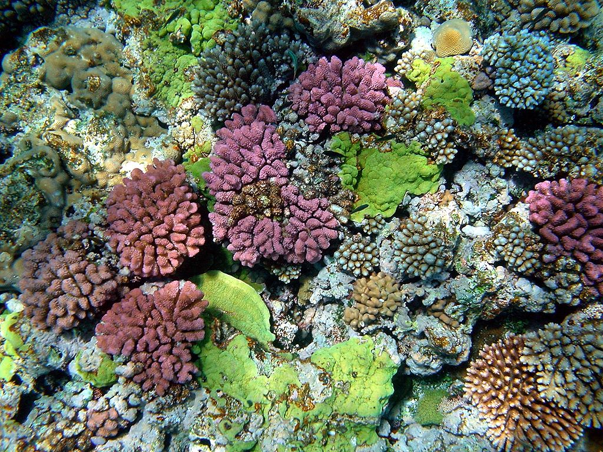

```{r setup, include=FALSE}
knitr::opts_chunk$set(echo = FALSE)
```




### source url 
https://www.newscientist.com/article/2254842-heat-resistant-corals-could-help-protect-reefs-against-hotter-waters/.
word count: 599

### vocabulary
|word from the text|synonym/definition in english|french translation|
| --- | --- | --- |
|to cope|syn: overcome|surmonter|
|heatwave|period while the hot weather|vague de chaleur|
|interbreeding|animal cross-bred with a other animal|croiser|
|undergo|syn: surgery|subir|
|widespead|covering a large area|étendu|
|wild|opp :domestic |sauvage|
|feasible|syn :praticable|faisable/ réalisable|
|scale|a system for measurement|échelle|
|strain|     |effort|
|adulthood|after 18 years|l'âge adulte|
|host|an animals infect by parasite |hôte|
|crossbred|it's a genetic combination|croisé ( hybride)|
|decades|10 years|Décennie|
|to overcome|syn : to cope|surmonter|

### analysis
|analysis|/     |
| --- | --- |
|Researchers?|Buerger, Line Bay|
|Published in? when (if mentioned)?|Newscientist, September 18,2020|
|General topic|This article is about the corals resistance in relation to heatwave. And it is about the solutions to save them|
|Procedure/ what was examined|Two resechears work on two  different methods involve to help the corals to resist heatwaves. Firstly Line Bay’s method who work on assisted evolution. Next Patrick Buerger’s method involve to work with algae which are symbiotic organism. He would like to do symbiosis with algae which are more heat resistant|
|Conclusions/ discovery|We can to help the corals grace genetic and symbiotic organisms like algae|
|Remaining questions|/|


