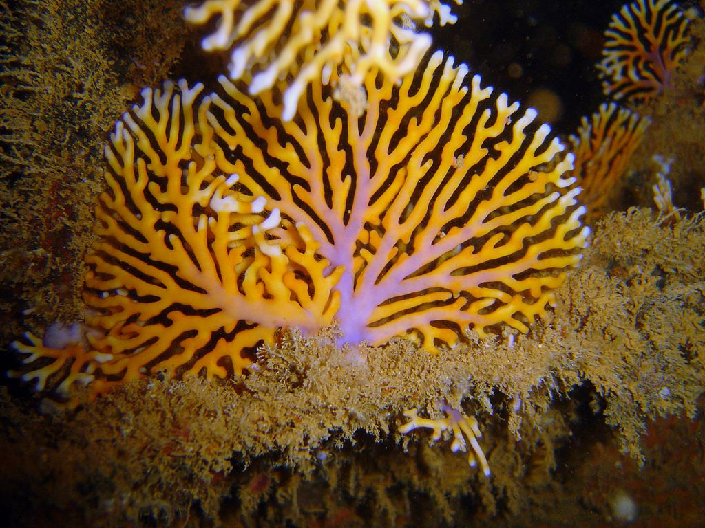

```{r setup, include=FALSE}
knitr::opts_chunk$set(echo = FALSE)
```




### source url 

https://www.sciencenews.org/article/corals-algae-neon-colors-bleaching-recovery-oceans
word count : 552

### vocabulary 
|Word from the text|Synonym/definition in English|French translation|
| --- | --- | --- |
|act as|syn: like|comme/en tant que|
|dwell|to live|habiter/deleuré|
|to struggle|to have difficult|avoir du mal|
|hues|colour|nuances/teintes|
|to shine|syn: to ligth|éclairer/diriger|
|uptick|increase|légère hausse|
|mild|syn: to lower|léger|
|to ramp up|intensity work|redoubler d'effort/accroitre|
|to plummet|syn: to fall|chuter|
|to bump up|syn: increase|augmenter|
|imblance|not equilibrium|désiquilibre|
|bounce|rebound|rebondir|
|to prompt|to take care yourself|se pomponner|
|vivildy|intensely|avec éclat|
|doom|dead|mort/perte|

|analysis|/     |
| --- | --- |
|Researchers?|Elena Bollati, Daniel Wangpraseurt and Jörg Wiedenmann|
|Published in? when (if mentioned)?|ScienceNews, May 29 2020|
|General topic|This article is about hue corals which change according the climate change.  Moreover, some wavelengths can have an effect on the corals colours with a pigment production. Certain neon colours are the effect of a nutritional imbalance|
|Procedure/ what was examined|To understand this changes. The researchers are working in labs. They realized a experiments in context such as increasing temperature in a aquarium. After several weeks, they observed that corals had bumped up their fluorescent.|
|Conclusions/ discovery|When they suffer  from a rise in temperature certain corals bump up their concentration in fluorescent and change colors. Furthermore, when the temperature is too high the symbiosis with alguae does not exist anymore which. But some corals producte more neon color to work as a sunscreen.|
|Remaining questions|/|


