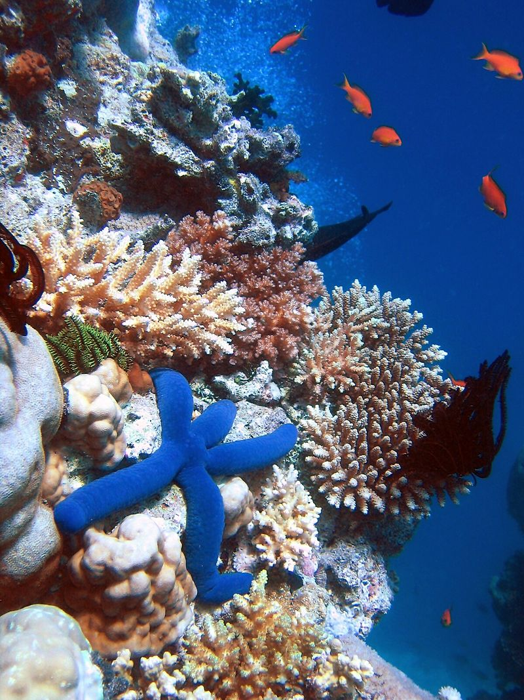

```{r setup, include=FALSE}
knitr::opts_chunk$set(echo = FALSE)
```



### source url 
https://www.sciencemag.org/news/2020/09/deep-beneath-high-seas-researchers-find-rich-coral-oases
words : 790

### vocabulary 
|Word from the text|Synonym/definition in English|French translation|
| --- | --- | --- |
|to bolster|syn: to support|soutenir/renforcer|
|handful|quantity|poignée|
|to shore|the land which border the sea|côte/rivage|
|to aim|choose a target|viser|
|slopes|syn: go up/down|être en pente/inclinaison|
|scleractinian|hard coral|scleractinien|
|escarpments|syn: narrow|escarpment|
|one-fifth| after one-fourth|cinquième|
|to gather|syn: collect|ramasser|
|scheduled|syn: planify|programmé/prévu|
|dimly lit|syn: lower|faiblement éclairé|
|slopes|syn: incline|pente|
|spindly|thin and long|filiforme/grêle|
|to target|syn: to aim|cibler|

|analysis|/     |
| --- | --- |
|Researchers?|Richard Pyle & Tina Molodtsova|
|Published in? when (if mentioned)?|Sciencemag, September 14 2020|
|General topic|This article is about a study  in relation to reef-building corals which are in the deep sea like seamounts. Moreover, the author explain  expeditions challenge which allow to get more information on seamounts|
|Procedure/ what was examined|The researchers identified 116 reefs in the high sea.They are between 200-1200 meters from the surface of the water.
the surface of the water. But  tonly one-fifth depth sea is protect even though the corals are sensitive. The researchers would like to get more information on the reef building corals sea. So,There will be two expeditions. The first will be to Napa Nui lead by Richard Pyle. The second will be to Nazca and Chile lead by Tina Molodtsova|
|Conclusions/ discovery|In the study all the coral recorders are  Scleractinian. The reefs are usually on seamount,…. The objective is of the expeditions are to record seamounts before the human effect|
|Remaining questions|/|


