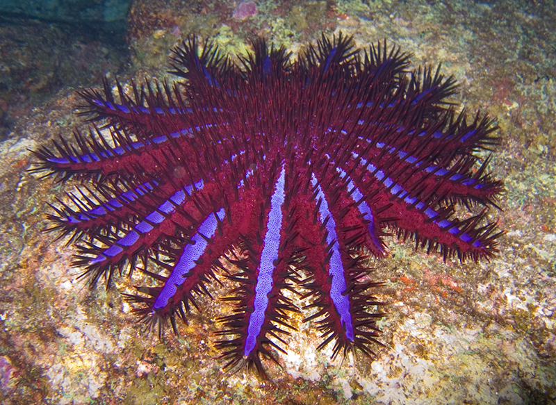

```{r setup, include=FALSE}
knitr::opts_chunk$set(echo = FALSE)
```





### source url 

https://www.newscientist.com/article/2258714-coral-eating-starfish-threaten-great-barrier-reef/ 
word count:527

### vocabulary

|Word from the text|Synonym/definition in English|French translation|
| --- | --- | --- |
|Threats|Syn: menace|Menace| 
|To shrink|Become smaller|Rétrécir| 
|Pests|Unwanted animal|Nuisible| 
|To stretch|Reach up|S’étirer| 
|To tow|Syn: pull|Tracter/remorquer|
|Assess|evaluate|jauger|
|Gliders|Animal : flying possum|Phalanger volant/ planeur|
|Culling|Animal: reduce population|Abattage| 
|To bait|Syn: catch|Appâter| 
|Trap|Snare|Piège| 
|To disrupt|Syn: interrupt|Pertuber| 

### Analysis

|analysis|/     |
| --- | --- |
|Researchers?|Bernard Degnan, Russ Badcock and his colleagues|
|Published in? when (if mentioned)?|NewScientist, November 2 2020|
|General topic|This article is  about crown-of-thorns that are noxious for the coral reef because of they feed on the corals.The starfish predators are less plentiful because overfishing.|
|Procedure/ what was examined| To reduce the starfish population the researchers thought of two ideas :Firstly the researchers would like to spot the starfishes on the reef either by diving or with robots.The best solution would be to use the robots so they would to concentrate on the starfish culling.Secondly, they have had the idea of controlling the starfish from an early age. Another approach would consist in introducing natural predators. Indeed scientists have discovered that these starfish released pheromones under stress other starfish sense these pheromones and stay away|
|Conclusions/ discovery|The coral reefs are already suffering by from the global warming and other human actions such as overfishing allow these starfish growth. Because of that the reefs are threatened given that feed on the coral them. So the biologists try of to find ideas to counter this pheromone.|
|Remaining questions|/|
