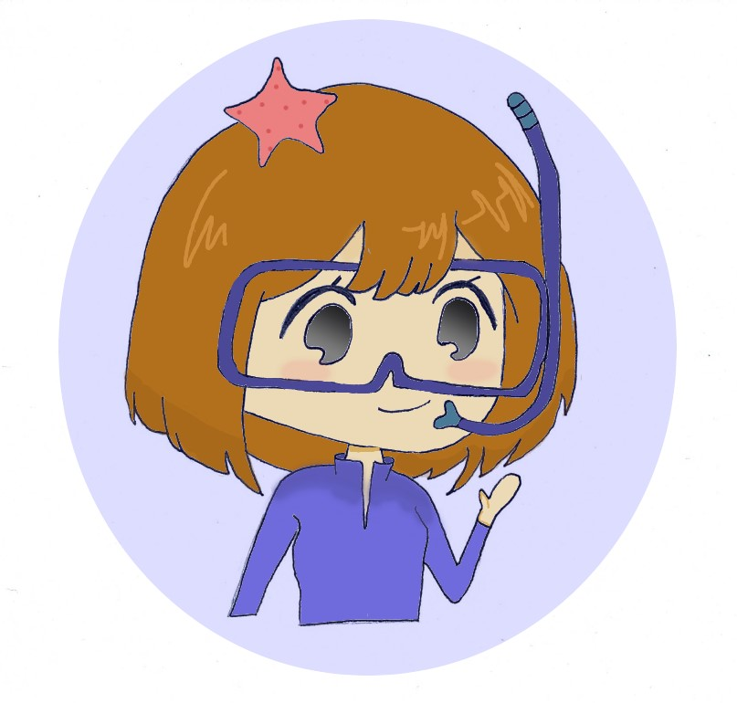

  I am a Umons student who studying the biology. I have choosen the coral's subject because I like the marine biology. Moreover, the corals are like the trees on the earth, they are necessary to good development of the marine life.  

- Lise Van Espen, Devilez, english class and 2020-2021
